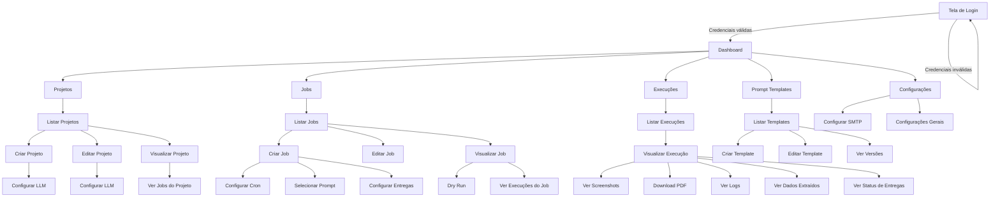
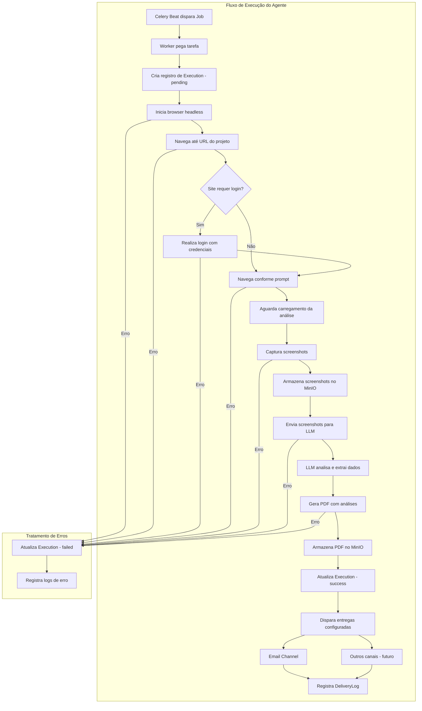
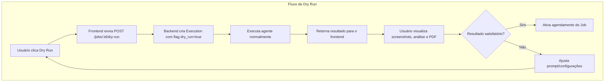
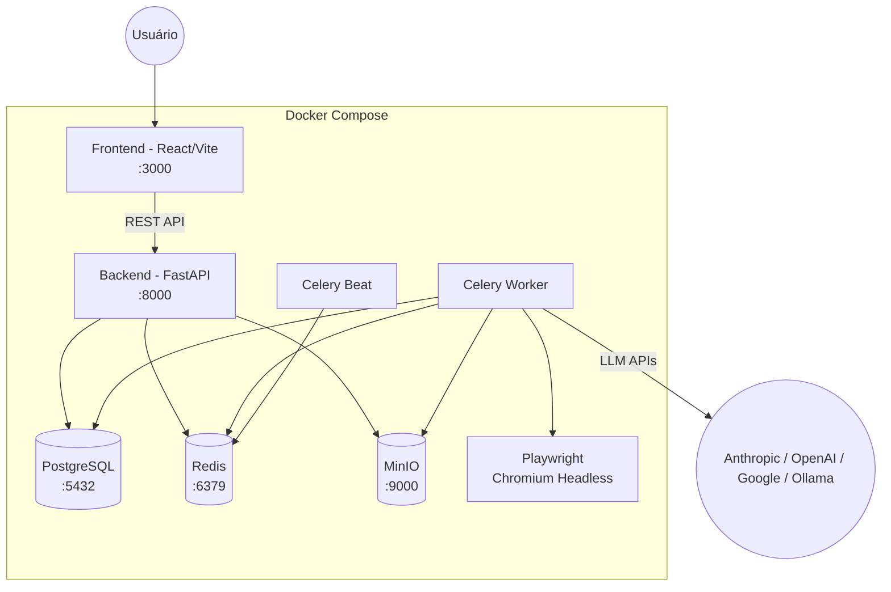
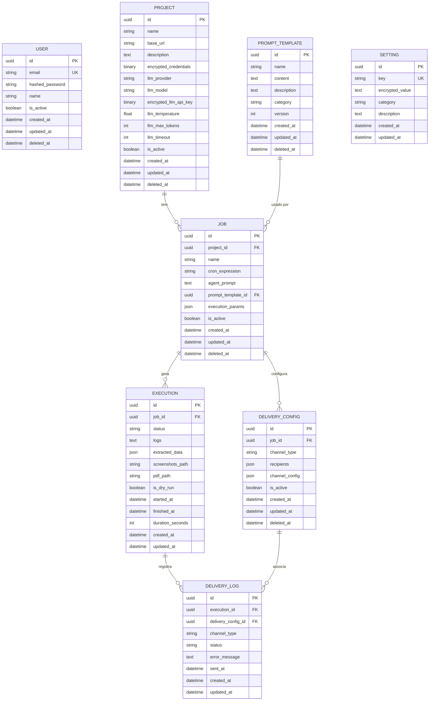

# AgentVision — Product Requirements Document (PRD)

**Versão:** 1.0
**Data:** 2026-02-22
**Status:** Draft

---

## Sumário

1. [Visão Geral](#1-visão-geral)
2. [Sobre o Produto](#2-sobre-o-produto)
3. [Propósito](#3-propósito)
4. [Público-Alvo](#4-público-alvo)
5. [Objetivos](#5-objetivos)
6. [Requisitos Funcionais](#6-requisitos-funcionais)
7. [Requisitos Não-Funcionais](#7-requisitos-não-funcionais)
8. [Arquitetura Técnica](#8-arquitetura-técnica)
9. [Design System](#9-design-system)
10. [User Stories](#10-user-stories)
11. [Métricas de Sucesso](#11-métricas-de-sucesso)
12. [Riscos e Mitigações](#12-riscos-e-mitigações)
13. [Lista de Tarefas](#13-lista-de-tarefas)

---

## 1. Visão Geral

O **AgentVision** é uma plataforma de automação que utiliza agentes de IA para navegar em sites, capturar screenshots de análises visuais, analisar o conteúdo com modelos de linguagem com suporte a visão (Claude, GPT-4o, Gemini, Ollama), gerar relatórios PDF profissionais e entregá-los automaticamente via canais configuráveis (email, OneDrive, WhatsApp, Webhook).

O sistema opera como uma ferramenta interna administrada por um usuário admin, que configura projetos (sites alvo), jobs (agendamentos), prompts de análise e canais de entrega. Toda a execução é automatizada via agentes de IA rodando em containers Docker com navegadores headless.

---

## 2. Sobre o Produto

| Atributo                 | Descrição                                        |
| ------------------------ | -------------------------------------------------- |
| **Nome**           | AgentVision                                        |
| **Tipo**           | Plataforma de automação de agentes de IA         |
| **Modelo**         | Self-hosted (Docker Compose)                       |
| **Usuários**      | Administrador único (v1)                          |
| **Backend**        | Python (FastAPI)                                   |
| **Frontend**       | React (Vite + TailwindCSS + shadcn/ui)             |
| **Banco de Dados** | PostgreSQL                                         |
| **Fila**           | Celery + Redis                                     |
| **Storage**        | MinIO (S3-compatible)                              |
| **Automação**    | browser-use + Playwright (Chromium headless)       |
| **IA**             | Multi-provider (Anthropic, OpenAI, Google, Ollama) |

---

## 3. Propósito

Automatizar o processo repetitivo e manual de:

- Acessar sites/sistemas para visualizar dashboards, relatórios ou análises.
- Capturar prints das telas relevantes.
- Interpretar e extrair informações das análises visuais.
- Gerar relatórios consolidados com insights.
- Distribuir esses relatórios para stakeholders por email ou outros canais.

O AgentVision transforma esse fluxo manual em uma pipeline automatizada, configurável e agendável, eliminando a necessidade de intervenção humana recorrente e garantindo consistência, pontualidade e escalabilidade na geração e entrega de relatórios.

---

## 4. Público-Alvo

| Perfil                                | Descrição                                                                                                                    |
| ------------------------------------- | ------------------------------------------------------------------------------------------------------------------------------ |
| **Analistas de dados**          | Profissionais que precisam gerar e distribuir relatórios recorrentes extraídos de dashboards de BI ou sistemas internos      |
| **Gestores de operações**     | Líderes que precisam receber análises periódicas de KPIs, métricas e indicadores sem acessar múltiplos sistemas           |
| **Equipes de BI**               | Times que automatizam a extração e distribuição de análises visuais de ferramentas como Power BI, Metabase, Grafana, etc. |
| **Administradores de sistemas** | Profissionais técnicos que configuram e mantêm a plataforma                                                                  |

---

## 5. Objetivos

### 5.1 Objetivos de Produto

- **O1** — Permitir configuração completa de projetos (sites alvo) com credenciais, URL base e configuração de LLM por projeto.
- **O2** — Permitir agendamento de jobs com cron expressions, prompt de agente customizável e canais de entrega configuráveis.
- **O3** — Executar agentes de IA que navegam em sites headless, capturam screenshots inteligentes e analisam visualmente o conteúdo.
- **O4** — Gerar relatórios PDF profissionais com screenshots, dados extraídos e insights gerados pela LLM.
- **O5** — Entregar relatórios automaticamente via canais configuráveis (email na v1).
- **O6** — Manter histórico completo de execuções com logs, screenshots, PDFs e status de entregas.
- **O7** — Suportar múltiplos providers de LLM (Anthropic, OpenAI, Google, Ollama) via Strategy/Factory Pattern.

### 5.2 Objetivos de Negócio

- **ON1** — Reduzir em 90% o tempo gasto em tarefas manuais de captura e distribuição de relatórios.
- **ON2** — Garantir entrega pontual e consistente de relatórios para stakeholders.
- **ON3** — Escalar a operação de geração de relatórios sem aumento proporcional de headcount.

---

## 6. Requisitos Funcionais

### 6.1 Autenticação (RF-AUTH)

| ID         | Requisito                                                                     |
| ---------- | ----------------------------------------------------------------------------- |
| RF-AUTH-01 | Login via email e senha com JWT                                               |
| RF-AUTH-02 | Geração de access token (curta duração) e refresh token (longa duração) |
| RF-AUTH-03 | Armazenamento seguro do token no frontend                                     |
| RF-AUTH-04 | Header Authorization em toda requisição autenticada                         |
| RF-AUTH-05 | Endpoint de refresh para renovar sessão                                      |
| RF-AUTH-06 | Logout com invalidação do token                                             |
| RF-AUTH-07 | Seed inicial para criação do usuário admin                                 |

### 6.2 Projetos (RF-PROJ)

| ID         | Requisito                                                                                       |
| ---------- | ----------------------------------------------------------------------------------------------- |
| RF-PROJ-01 | CRUD completo de projetos                                                                       |
| RF-PROJ-02 | Campos: nome, URL base, descrição, credenciais criptografadas do site alvo                    |
| RF-PROJ-03 | Configuração de LLM por projeto (provider, modelo, API key, temperature, max_tokens, timeout) |
| RF-PROJ-04 | Seleção dinâmica de modelos disponíveis com base no provider selecionado                    |
| RF-PROJ-05 | Soft delete de projetos                                                                         |
| RF-PROJ-06 | Listagem com filtros e paginação                                                              |
| RF-PROJ-07 | Visualização de jobs associados ao projeto                                                    |

### 6.3 Jobs (RF-JOB)

| ID        | Requisito                                                                                                 |
| --------- | --------------------------------------------------------------------------------------------------------- |
| RF-JOB-01 | CRUD completo de jobs vinculados a um projeto                                                             |
| RF-JOB-02 | Campos: nome, cron expression, prompt do agente, parâmetros de execução (JSON), status (ativo/inativo) |
| RF-JOB-03 | Configuração de canais de entrega por job                                                               |
| RF-JOB-04 | Ativação/desativação de jobs                                                                          |
| RF-JOB-05 | Dry run — execução manual de um job para validação                                                   |
| RF-JOB-06 | Listagem com filtros por projeto, status e paginação                                                    |
| RF-JOB-07 | Visualização da próxima execução agendada                                                            |
| RF-JOB-08 | Associação com prompt templates                                                                         |

### 6.4 Execuções (RF-EXEC)

| ID         | Requisito                                                             |
| ---------- | --------------------------------------------------------------------- |
| RF-EXEC-01 | Registro automático de cada execução de job                        |
| RF-EXEC-02 | Status: pending, running, success, failed                             |
| RF-EXEC-03 | Armazenamento de logs de execução                                   |
| RF-EXEC-04 | Referências aos screenshots no MinIO                                 |
| RF-EXEC-05 | Referência ao PDF gerado no MinIO                                    |
| RF-EXEC-06 | Dados extraídos em JSON estruturado                                  |
| RF-EXEC-07 | Timestamps de início e fim                                           |
| RF-EXEC-08 | Listagem com filtros por job, projeto, status, período e paginação |
| RF-EXEC-09 | Visualização detalhada com screenshots, PDF, logs e dados           |
| RF-EXEC-10 | Download de PDF diretamente pelo frontend                             |

### 6.5 Entregas (RF-DELIV)

| ID          | Requisito                                                                  |
| ----------- | -------------------------------------------------------------------------- |
| RF-DELIV-01 | Configuração de canal de entrega por job (tipo, destinatários, configs) |
| RF-DELIV-02 | Canal de email com SMTP configurável                                      |
| RF-DELIV-03 | Registro de log de cada tentativa de entrega                               |
| RF-DELIV-04 | Status de entrega: pending, sent, failed                                   |
| RF-DELIV-05 | Arquitetura extensível para novos canais (Strategy Pattern)               |
| RF-DELIV-06 | Reenvio manual de entregas falhas                                          |

### 6.6 Agentes de IA (RF-AGENT)

| ID          | Requisito                                                               |
| ----------- | ----------------------------------------------------------------------- |
| RF-AGENT-01 | Navegação headless via browser-use + Playwright                       |
| RF-AGENT-02 | Login automático em sites alvo com credenciais do projeto              |
| RF-AGENT-03 | Navegação inteligente guiada por prompt (menus, filtros, parâmetros) |
| RF-AGENT-04 | Detecção inteligente do momento ideal para screenshot                 |
| RF-AGENT-05 | Captura de screenshots e armazenamento no MinIO                         |
| RF-AGENT-06 | Análise visual dos screenshots via LLM configurada no projeto          |
| RF-AGENT-07 | Extração de dados estruturados (JSON) a partir da análise visual     |
| RF-AGENT-08 | Geração de PDF com screenshots, análises e insights                  |
| RF-AGENT-09 | Suporte multi-provider de LLM (Anthropic, OpenAI, Google, Ollama)       |

### 6.7 Prompt Templates (RF-PROMPT)

| ID           | Requisito                                           |
| ------------ | --------------------------------------------------- |
| RF-PROMPT-01 | CRUD de templates de prompts                        |
| RF-PROMPT-02 | Campos: nome, conteúdo, descrição, categoria     |
| RF-PROMPT-03 | Versionamento de templates (histórico de versões) |
| RF-PROMPT-04 | Associação de templates a jobs                    |
| RF-PROMPT-05 | Listagem com filtros e paginação                  |

### 6.8 Configurações (RF-SET)

| ID        | Requisito                                          |
| --------- | -------------------------------------------------- |
| RF-SET-01 | Configuração de SMTP para envio de emails        |
| RF-SET-02 | Armazenamento seguro de configurações sensíveis |
| RF-SET-03 | Interface de configurações gerais do sistema     |

### 6.9 Dashboard (RF-DASH)

| ID         | Requisito                                                    |
| ---------- | ------------------------------------------------------------ |
| RF-DASH-01 | Resumo de projetos ativos                                    |
| RF-DASH-02 | Quantidade de jobs configurados (ativos/inativos)            |
| RF-DASH-03 | Últimas execuções com status (sucesso/falha/em andamento) |
| RF-DASH-04 | Próximas execuções agendadas                              |
| RF-DASH-05 | Alertas de falhas recentes                                   |

### 6.10 Flowchart — Fluxos de UX







---

## 7. Requisitos Não-Funcionais

### 7.1 Performance

| ID          | Requisito                                                        |
| ----------- | ---------------------------------------------------------------- |
| RNF-PERF-01 | A API deve responder em < 500ms para endpoints de listagem       |
| RNF-PERF-02 | Screenshots devem ser armazenados e recuperados do MinIO em < 2s |
| RNF-PERF-03 | O frontend deve carregar a página inicial (após cache) em < 2s |
| RNF-PERF-04 | A fila Celery deve processar jobs sem acúmulo significativo     |

### 7.2 Segurança

| ID         | Requisito                                                          |
| ---------- | ------------------------------------------------------------------ |
| RNF-SEC-01 | Senhas armazenadas com bcrypt                                      |
| RNF-SEC-02 | Credenciais de sites alvo criptografadas em repouso (Fernet/AES)   |
| RNF-SEC-03 | API keys de LLM criptografadas em repouso                          |
| RNF-SEC-04 | JWT com expiração configurável (access: 30min, refresh: 7 dias) |
| RNF-SEC-05 | CORS configurado apenas para o frontend                            |
| RNF-SEC-06 | Variáveis sensíveis via .env, nunca hardcoded                    |
| RNF-SEC-07 | MinIO com credenciais dedicadas e buckets isolados                 |

### 7.3 Disponibilidade

| ID           | Requisito                                                                    |
| ------------ | ---------------------------------------------------------------------------- |
| RNF-AVAIL-01 | Todos os serviços devem reiniciar automaticamente via Docker restart policy |
| RNF-AVAIL-02 | Health checks em todos os containers                                         |
| RNF-AVAIL-03 | Logs centralizados via stdout/stderr (Docker logs)                           |

### 7.4 Manutenibilidade

| ID           | Requisito                                                  |
| ------------ | ---------------------------------------------------------- |
| RNF-MAINT-01 | Código Python seguindo PEP8 com type hints                |
| RNF-MAINT-02 | Código frontend seguindo ESLint + Prettier                |
| RNF-MAINT-03 | Modularização por domínio no backend                    |
| RNF-MAINT-04 | Migrações de banco com Alembic                           |
| RNF-MAINT-05 | Variáveis de ambiente centralizadas com pydantic-settings |

### 7.5 Escalabilidade

| ID           | Requisito                                                        |
| ------------ | ---------------------------------------------------------------- |
| RNF-SCALE-01 | Workers Celery escalonáveis horizontalmente                     |
| RNF-SCALE-02 | Suporte a múltiplos jobs concorrentes                           |
| RNF-SCALE-03 | Banco PostgreSQL com índices otimizados para queries frequentes |

---

## 8. Arquitetura Técnica

### 8.1 Stack

| Camada                 | Tecnologia                                             |
| ---------------------- | ------------------------------------------------------ |
| **Frontend**     | React 18 + Vite + TypeScript + TailwindCSS + shadcn/ui |
| **Backend**      | Python 3.13 + FastAPI + Uvicorn                        |
| **ORM**          | SQLAlchemy 2.x + Alembic                               |
| **Banco**        | PostgreSQL 16                                          |
| **Fila**         | Celery 5.x + Celery Beat                               |
| **Broker**       | Redis 7                                                |
| **Storage**      | MinIO (S3-compatible)                                  |
| **Automação**  | browser-use + Playwright (Chromium headless)           |
| **IA / LLM**     | Anthropic API, OpenAI API, Google AI API, Ollama       |
| **PDF**          | ReportLab ou WeasyPrint                                |
| **Email**        | smtplib (Python stdlib)                                |
| **Auth**         | JWT (python-jose) + bcrypt (passlib)                   |
| **Criptografia** | cryptography (Fernet)                                  |
| **Containers**   | Docker + Docker Compose                                |
| **Ícones**      | Lucide Icons                                           |

### 8.2 Diagrama de Containers



### 8.3 Estrutura de Dados



---

## 9. Design System

### 9.1 Paleta de Cores

#### Cores Primárias

| Token             | Cor         | Hex         | Uso                                              |
| ----------------- | ----------- | ----------- | ------------------------------------------------ |
| `primary-500`   | Azul        | `#6366F1` | Botões primários, links, elementos de destaque |
| `primary-600`   | Azul escuro | `#4F46E5` | Hover de botões primários                      |
| `primary-400`   | Azul claro  | `#818CF8` | Bordas ativas, focus rings                       |
| `secondary-500` | Roxo        | `#8B5CF6` | Elementos secundários, gradientes               |
| `secondary-600` | Roxo escuro | `#7C3AED` | Hover de elementos secundários                  |
| `accent-cyan`   | Ciano       | `#22D3EE` | Status ativo, indicadores positivos              |
| `accent-green`  | Verde       | `#10B981` | Sucesso, confirmações                          |

#### Cores de Status

| Token              | Cor      | Hex         | Uso                    |
| ------------------ | -------- | ----------- | ---------------------- |
| `status-success` | Verde    | `#10B981` | Execução com sucesso |
| `status-error`   | Vermelho | `#EF4444` | Falha, erro            |
| `status-warning` | Amarelo  | `#F59E0B` | Alertas, atenção     |
| `status-running` | Ciano    | `#22D3EE` | Em andamento           |
| `status-pending` | Cinza    | `#6B7280` | Pendente, aguardando   |

#### Cores de Fundo (Dark Mode)

| Token              | Cor             | Hex         | Uso                                       |
| ------------------ | --------------- | ----------- | ----------------------------------------- |
| `bg-base`        | Cinza escuro    | `#0F1117` | Fundo da aplicação                      |
| `bg-surface`     | Cinza           | `#1A1D2E` | Cards, painéis, sidebar                  |
| `bg-elevated`    | Cinza claro     | `#242838` | Modais, dropdowns, tooltips               |
| `bg-hover`       | Cinza highlight | `#2A2F42` | Hover em linhas de tabela, itens de lista |
| `border-default` | Cinza borda     | `#2E3348` | Bordas de cards, separadores              |
| `border-focus`   | Azul            | `#6366F1` | Focus ring de inputs                      |

#### Texto

| Token              | Cor         | Hex         | Uso                              |
| ------------------ | ----------- | ----------- | -------------------------------- |
| `text-primary`   | Branco      | `#F9FAFB` | Texto principal, títulos        |
| `text-secondary` | Cinza claro | `#9CA3AF` | Texto secundário, labels        |
| `text-muted`     | Cinza       | `#6B7280` | Texto desabilitado, placeholders |

### 9.2 Tipografia

| Elemento            | Font           | Tamanho | Peso     | TailwindCSS                |
| ------------------- | -------------- | ------- | -------- | -------------------------- |
| **H1**        | Inter          | 30px    | Bold     | `text-3xl font-bold`     |
| **H2**        | Inter          | 24px    | Semibold | `text-2xl font-semibold` |
| **H3**        | Inter          | 20px    | Semibold | `text-xl font-semibold`  |
| **H4**        | Inter          | 16px    | Medium   | `text-base font-medium`  |
| **Body**      | Inter          | 14px    | Regular  | `text-sm font-normal`    |
| **Small**     | Inter          | 12px    | Regular  | `text-xs font-normal`    |
| **Code/Mono** | JetBrains Mono | 13px    | Regular  | `font-mono text-sm`      |

### 9.3 Componentes

#### Botões

```
Primário:
  bg-[#6366F1] hover:bg-[#4F46E5] text-white rounded-lg px-4 py-2
  font-medium text-sm transition-colors

Secundário:
  bg-transparent border border-[#2E3348] hover:bg-[#2A2F42]
  text-[#9CA3AF] hover:text-white rounded-lg px-4 py-2
  font-medium text-sm transition-colors

Destrutivo:
  bg-[#EF4444] hover:bg-[#DC2626] text-white rounded-lg px-4 py-2
  font-medium text-sm transition-colors

Ghost:
  bg-transparent hover:bg-[#2A2F42] text-[#9CA3AF] hover:text-white
  rounded-lg px-4 py-2 font-medium text-sm transition-colors
```

#### Inputs

```
Input padrão:
  bg-[#1A1D2E] border border-[#2E3348] rounded-lg px-3 py-2
  text-sm text-[#F9FAFB] placeholder-[#6B7280]
  focus:border-[#6366F1] focus:ring-1 focus:ring-[#6366F1]
  transition-colors

Select:
  Mesmo estilo do input + ícone ChevronDown (Lucide) à direita

Textarea:
  Mesmo estilo do input + resize-y min-h-[100px]
```

#### Cards

```
Card padrão:
  bg-[#1A1D2E] border border-[#2E3348] rounded-xl p-6

Card de métrica (dashboard):
  bg-[#1A1D2E] border border-[#2E3348] rounded-xl p-6
  + ícone com bg colorido (rounded-lg p-2)
  + valor numérico text-2xl font-bold
  + label text-sm text-[#9CA3AF]
```

#### Tabelas

```
Container:
  bg-[#1A1D2E] border border-[#2E3348] rounded-xl overflow-hidden

Header:
  bg-[#242838] text-xs font-medium text-[#9CA3AF] uppercase
  tracking-wider px-6 py-3

Row:
  border-b border-[#2E3348] px-6 py-4 text-sm text-[#F9FAFB]
  hover:bg-[#2A2F42] transition-colors

Paginação:
  flex justify-between items-center px-6 py-3 border-t border-[#2E3348]
```

#### Badges de Status

```
Sucesso:
  bg-[#10B981]/10 text-[#10B981] text-xs font-medium px-2.5 py-0.5
  rounded-full

Erro:
  bg-[#EF4444]/10 text-[#EF4444] text-xs font-medium px-2.5 py-0.5
  rounded-full

Em andamento:
  bg-[#22D3EE]/10 text-[#22D3EE] text-xs font-medium px-2.5 py-0.5
  rounded-full + ícone Loader2 animado

Pendente:
  bg-[#6B7280]/10 text-[#6B7280] text-xs font-medium px-2.5 py-0.5
  rounded-full

Alerta:
  bg-[#F59E0B]/10 text-[#F59E0B] text-xs font-medium px-2.5 py-0.5
  rounded-full
```

#### Sidebar

```
Container:
  bg-[#1A1D2E] border-r border-[#2E3348] w-64
  (colapsado: w-16) transition-all duration-300

Logo:
  px-6 py-5 border-b border-[#2E3348]
  Ícone + "AgentVision" text-lg font-bold
  gradiente text-transparent bg-clip-text bg-gradient-to-r
  from-[#6366F1] to-[#8B5CF6]

Item de menu:
  flex items-center gap-3 px-4 py-2.5 mx-2 rounded-lg
  text-sm text-[#9CA3AF] hover:text-white hover:bg-[#2A2F42]
  transition-colors

Item ativo:
  bg-[#6366F1]/10 text-[#6366F1] font-medium

Ícones (Lucide):
  LayoutDashboard, FolderKanban, CalendarClock, History,
  FileText, Settings, LogOut, ChevronLeft/Right
```

#### Modais

```
Overlay:
  fixed inset-0 bg-black/60 backdrop-blur-sm z-50

Container:
  bg-[#1A1D2E] border border-[#2E3348] rounded-xl
  shadow-2xl max-w-lg w-full mx-4 p-6

Header:
  flex justify-between items-center mb-6
  Título: text-lg font-semibold text-[#F9FAFB]
  Fechar: ícone X (Lucide) text-[#6B7280] hover:text-white

Footer:
  flex justify-end gap-3 mt-6 pt-4 border-t border-[#2E3348]
```

#### Forms

```
Layout:
  flex flex-col gap-4

Label:
  text-sm font-medium text-[#F9FAFB] mb-1

Grupo:
  flex flex-col gap-1.5

Erro:
  text-xs text-[#EF4444] mt-1

Dica:
  text-xs text-[#6B7280] mt-1
```

### 9.4 Ícones (Lucide Icons)

| Contexto         | Ícone                             |
| ---------------- | ---------------------------------- |
| Dashboard        | `LayoutDashboard`                |
| Projetos         | `FolderKanban`                   |
| Jobs             | `CalendarClock`                  |
| Execuções      | `History`                        |
| Prompt Templates | `FileText`                       |
| Configurações  | `Settings`                       |
| Logout           | `LogOut`                         |
| Sucesso          | `CheckCircle2`                   |
| Erro             | `XCircle`                        |
| Em andamento     | `Loader2` (animado)              |
| Pendente         | `Clock`                          |
| Alerta           | `AlertTriangle`                  |
| Adicionar        | `Plus`                           |
| Editar           | `Pencil`                         |
| Excluir          | `Trash2`                         |
| Visualizar       | `Eye`                            |
| Download         | `Download`                       |
| Email            | `Mail`                           |
| Play (Dry Run)   | `Play`                           |
| Busca            | `Search`                         |
| Filtro           | `Filter`                         |
| Colapsar sidebar | `ChevronLeft` / `ChevronRight` |

---

## 10. User Stories

### Épico 1: Autenticação e Acesso

**US-01: Login no sistema**

> Como administrador, quero fazer login com email e senha para acessar o painel do AgentVision.

**Critérios de aceite:**

- [ ] Tela de login com campos de email e senha.
- [ ] Validação de campos obrigatórios no frontend.
- [ ] Ao submeter credenciais válidas, redirecionar para o Dashboard.
- [ ] Ao submeter credenciais inválidas, exibir mensagem de erro.
- [ ] Token JWT armazenado de forma segura.
- [ ] Refresh token para manter sessão ativa.

**US-02: Logout do sistema**

> Como administrador, quero fazer logout para encerrar minha sessão de forma segura.

**Critérios de aceite:**

- [ ] Botão de logout na sidebar.
- [ ] Ao clicar, remover tokens e redirecionar para a tela de login.
- [ ] Requisições subsequentes sem token devem retornar 401.

**US-03: Sessão persistente**

> Como administrador, quero que minha sessão se mantenha ativa enquanto uso o sistema, sem precisar logar repetidamente.

**Critérios de aceite:**

- [ ] Refresh token renova o access token automaticamente antes de expirar.
- [ ] Se o refresh token expirar, redirecionar para login.

---

### Épico 2: Gestão de Projetos

**US-04: Criar projeto**

> Como administrador, quero criar um projeto configurando o site alvo, credenciais e modelo de LLM para que o agente saiba onde e como executar.

**Critérios de aceite:**

- [ ] Formulário com nome, URL base, descrição, credenciais do site.
- [ ] Seção de configuração de LLM: provider, modelo, API key, temperature, max_tokens, timeout.
- [ ] Lista de modelos se ajusta ao provider selecionado.
- [ ] Credenciais e API key criptografadas antes de salvar.
- [ ] Projeto criado aparece na listagem.

**US-05: Listar e filtrar projetos**

> Como administrador, quero ver todos os meus projetos com filtros para encontrar rapidamente o que preciso.

**Critérios de aceite:**

- [ ] Lista paginada de projetos.
- [ ] Filtro por nome e status (ativo/inativo).
- [ ] Exibir nome, URL, provider de LLM, quantidade de jobs, status.

**US-06: Editar projeto**

> Como administrador, quero editar as configurações de um projeto existente.

**Critérios de aceite:**

- [ ] Formulário preenchido com dados atuais.
- [ ] Possibilidade de atualizar todos os campos.
- [ ] Credenciais e API key exibidas como mascaradas.

**US-07: Excluir projeto**

> Como administrador, quero desativar um projeto que não uso mais.

**Critérios de aceite:**

- [ ] Soft delete (marca deleted_at).
- [ ] Modal de confirmação antes de excluir.
- [ ] Jobs associados são desativados.
- [ ] Projeto não aparece mais na listagem padrão.

---

### Épico 3: Gestão de Jobs

**US-08: Criar job**

> Como administrador, quero criar um job vinculado a um projeto, configurando agendamento, prompt e canais de entrega.

**Critérios de aceite:**

- [ ] Seleção de projeto.
- [ ] Campo de cron expression com preview da próxima execução.
- [ ] Campo de prompt do agente (texto livre ou seleção de template).
- [ ] Parâmetros de execução em JSON.
- [ ] Configuração de pelo menos um canal de entrega.
- [ ] Job criado como inativo por padrão.

**US-09: Executar dry run**

> Como administrador, quero executar um job manualmente (dry run) para validar o resultado antes de ativar o agendamento.

**Critérios de aceite:**

- [ ] Botão "Dry Run" na tela de detalhes do job.
- [ ] Execução imediata do agente.
- [ ] Resultado exibido com screenshots, análise e PDF.
- [ ] Execução registrada com flag is_dry_run=true.
- [ ] Dry run não dispara entregas.

**US-10: Ativar/desativar job**

> Como administrador, quero ativar ou desativar um job para controlar quais agendamentos estão rodando.

**Critérios de aceite:**

- [ ] Toggle de ativação na listagem e no detalhe.
- [ ] Job ativo é registrado no Celery Beat.
- [ ] Job inativo é removido do Celery Beat.

**US-11: Configurar canais de entrega do job**

> Como administrador, quero configurar os canais de entrega de um job para que o PDF seja enviado automaticamente.

**Critérios de aceite:**

- [ ] Seleção de tipo de canal (email).
- [ ] Configuração de destinatários (lista de emails).
- [ ] Possibilidade de múltiplos canais por job.
- [ ] Ativação/desativação individual de cada canal.

---

### Épico 4: Execuções e Histórico

**US-12: Visualizar histórico de execuções**

> Como administrador, quero ver o histórico de todas as execuções com filtros para monitorar a saúde do sistema.

**Critérios de aceite:**

- [ ] Lista paginada de execuções.
- [ ] Filtros: job, projeto, status, período.
- [ ] Colunas: job, projeto, status (badge), início, duração, ações.

**US-13: Visualizar detalhes de uma execução**

> Como administrador, quero ver todos os detalhes de uma execução específica.

**Critérios de aceite:**

- [ ] Screenshots capturados (galeria).
- [ ] PDF gerado com botão de download.
- [ ] Logs de execução.
- [ ] Dados extraídos (JSON formatado).
- [ ] Status de cada entrega.
- [ ] Timestamps e duração.

**US-14: Reenviar entrega falha**

> Como administrador, quero reenviar uma entrega que falhou sem precisar reexecutar o job inteiro.

**Critérios de aceite:**

- [ ] Botão "Reenviar" em entregas com status "failed".
- [ ] Nova tentativa de envio pelo canal configurado.
- [ ] Novo registro em DeliveryLog.

---

### Épico 5: Prompt Templates

**US-15: Gerenciar prompt templates**

> Como administrador, quero criar e gerenciar templates de prompts reutilizáveis para meus agentes.

**Critérios de aceite:**

- [ ] CRUD de templates (nome, conteúdo, descrição, categoria).
- [ ] Versionamento: ao editar, incrementa versão e mantém histórico.
- [ ] Possibilidade de usar template ao criar/editar job.

---

### Épico 6: Configurações

**US-16: Configurar SMTP**

> Como administrador, quero configurar o servidor SMTP para que o sistema possa enviar emails.

**Critérios de aceite:**

- [ ] Campos: host, porta, usuário, senha, TLS, email remetente.
- [ ] Botão "Testar conexão" que envia email de teste.
- [ ] Configurações salvas de forma criptografada.

---

### Épico 7: Dashboard

**US-17: Visualizar dashboard**

> Como administrador, quero ver um resumo geral do sistema ao fazer login.

**Critérios de aceite:**

- [ ] Cards com: projetos ativos, jobs ativos, execuções hoje, taxa de sucesso.
- [ ] Lista de últimas execuções com status.
- [ ] Lista de próximas execuções agendadas.
- [ ] Alertas de falhas recentes (últimas 24h).

---

## 11. Métricas de Sucesso

### 11.1 KPIs de Produto

| KPI                                      | Meta        | Medição                                               |
| ---------------------------------------- | ----------- | ------------------------------------------------------- |
| **Taxa de sucesso de execuções** | > 95%       | Execuções com status "success" / total de execuções |
| **Taxa de entrega**                | > 98%       | Entregas com status "sent" / total de entregas          |
| **Tempo médio de execução**     | < 5 minutos | Média de duration_seconds das execuções              |
| **Uptime do sistema**              | > 99%       | Tempo disponível / tempo total                         |

### 11.2 KPIs de Usuário

| KPI                                      | Meta            | Medição                           |
| ---------------------------------------- | --------------- | ----------------------------------- |
| **Projetos configurados**          | > 5 em 30 dias  | Contagem de projetos ativos         |
| **Jobs ativos**                    | > 10 em 30 dias | Contagem de jobs com is_active=true |
| **Execuções diárias**           | > 20            | Contagem de execuções por dia     |
| **Tempo de configuração de job** | < 10 minutos    | Tempo entre criar e ativar um job   |

### 11.3 KPIs de Engenharia

| KPI                                      | Meta                 | Medição                    |
| ---------------------------------------- | -------------------- | ---------------------------- |
| **Tempo de resposta da API (p95)** | < 500ms              | Logs de resposta do FastAPI  |
| **Tempo de build do frontend**     | < 30s                | Tempo de `vite build`      |
| **Tamanho do bundle frontend**     | < 500KB gzip         | Output do Vite               |
| **Cobertura de testes**            | > 80% (sprint final) | pytest-cov + vitest coverage |

---

## 12. Riscos e Mitigações

| #   | Risco                                                  | Impacto  | Probabilidade | Mitigação                                                                                                                                  |
| --- | ------------------------------------------------------ | -------- | ------------- | -------------------------------------------------------------------------------------------------------------------------------------------- |
| R1  | Sites alvo alteram estrutura/layout frequentemente     | Alto     | Média        | Prompts flexíveis e genéricos; agente guiado por IA em vez de seletores fixos; logs detalhados para debug rápido                          |
| R2  | LLM retorna análises incorretas ou alucinações      | Alto     | Média        | Prompt engineering robusto; validação humana via dry run antes de ativar; logs com screenshots para auditoria                              |
| R3  | Sites alvo bloqueiam acesso headless (anti-bot)        | Alto     | Alta          | Uso de user-agents realistas; rate limiting entre execuções; possibilidade de configurar proxies; fingerprint customizado                  |
| R4  | Custo elevado de APIs de LLM                           | Médio   | Alta          | Suporte multi-provider permite usar modelos mais baratos; Ollama como alternativa local; temperature e max_tokens configuráveis por projeto |
| R5  | Falha na entrega de emails (SMTP)                      | Médio   | Baixa         | Retry automático; logs de entrega; alerta no dashboard; possibilidade de reenvio manual                                                     |
| R6  | Crescimento do storage (MinIO)                         | Médio   | Média        | Política de retenção configurável (futuro); monitoramento de uso de disco                                                                |
| R7  | Browser headless consome muita memória/CPU            | Alto     | Média        | Limitar concorrência de workers; timeout em execuções; restart automático de containers                                                  |
| R8  | Credenciais de sites alvo expostas                     | Crítico | Baixa         | Criptografia Fernet em repouso; variáveis de ambiente; nunca logar credenciais; acesso restrito ao banco                                    |
| R9  | Downtime do Redis causa perda de jobs agendados        | Alto     | Baixa         | Redis com persistência (AOF); Docker restart policy always; monitoramento de health                                                         |
| R10 | Dificuldade de manutenção com crescimento do código | Médio   | Média        | Arquitetura modular por domínio; padrões de código (PEP8/ESLint); documentação de módulos                                              |

---
